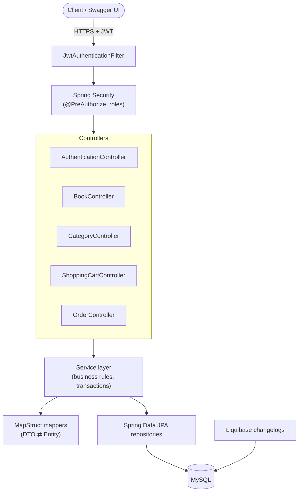

# 📚 Online Book Store

> A secure, production-style REST API for browsing books, managing a shopping cart, and placing orders — built to show that "just another CRUD app" can still be done *properly*.

[](https://openjdk.org/)
[](https://spring.io/projects/spring-boot)
[](https://www.mysql.com/)
[](https://www.liquibase.org/)
[](https://www.docker.com/)
[](https://github.com/features/actions)

---

## 💡 Why this project exists

Every online bookstore looks simple from the outside: browse books, add them to a cart, check out. The interesting part is everywhere else — *who* is allowed to see what, *how* a cart survives across requests, *what* happens to historical orders when a book gets deleted, and *how* you keep all of that consistent as the schema evolves.

This project was built to answer those questions properly instead of hand-waving them:

- Real **role-based access control** (`USER` / `ADMIN`), not just "is logged in or not."
- A **stateless JWT** session model instead of server-side sessions, so the API scales horizontally without sticky sessions.
- **Soft deletes** for books and users, so deleting a book from the catalog never breaks the history of an order that already contains it.
- **Schema evolution via Liquibase**, so the database structure has the same version history as the code that depends on it.
- A genuine **test pyramid** — repository, service, and controller tests, including integration tests against a real MySQL instance via Testcontainers — not just a couple of happy-path unit tests for show.

The result is a small but honestly-engineered slice of what a real e-commerce backend looks like.

---

## 🛠️ Tech stack

| Layer | Technology |
|---|---|
| Language / Runtime | Java 21 |
| Framework | Spring Boot 3.2.5 (Web, Validation, Security) |
| Security | Spring Security 6 + JJWT (JSON Web Tokens), method-level `@PreAuthorize` |
| Persistence | Spring Data JPA / Hibernate, MySQL 8.4 |
| Schema management | Liquibase (11 incremental, idempotent changesets) |
| Mapping | MapStruct (compile-time DTO ⇄ entity mapping) |
| Boilerplate reduction | Lombok |
| API documentation | springdoc-openapi (Swagger UI / OpenAPI 3) |
| Testing | JUnit 5, Spring Boot Test, Spring Security Test, Testcontainers (MySQL), MockMvc |
| Code quality | Checkstyle (Mate Academy style guide), JaCoCo coverage reports |
| Build & CI | Maven, GitHub Actions (verify on every push/PR) |
| Containerization | Docker, multi-stage build, Docker Compose (app + MySQL) |

---

## 🏗️ Architecture at a glance



The flow is intentionally boring and predictable: every request passes through the JWT filter, gets authorized by role, hits a thin controller, and the actual decisions (stock checks, cart validation, total calculation, order snapshotting) live in the service layer — never in the controller, never in the entity.

---

## 🎮 What each controller actually does

### `AuthenticationController` — `/auth`
- `POST /auth/registration` — registers a new user, hashes the password with BCrypt, assigns the default `USER` role.
- `POST /auth/login` — authenticates credentials and returns a signed JWT to use as a Bearer token on every subsequent call.

### `BookController` — `/books`
- Full CRUD for the book catalog: paginated listing (sorted by title by default), fetch by ID, create, update, soft-delete.
- Read endpoints are open to `USER` and `ADMIN`; write endpoints (`POST`/`PUT`/`DELETE`) are restricted to `ADMIN`.

### `CategoryController` — `/categories`
- CRUD for categories, plus `GET /categories/{id}/books` to browse a paginated, category-filtered slice of the catalog.
- Same read/write split as books: everyone can browse, only admins can curate.

### `ShoppingCartController` — `/cart`
- A per-user cart: fetch the current cart, add a book, update an item's quantity, remove an item.
- Every endpoint resolves the cart from the authenticated principal (`@AuthenticationPrincipal User user`) — there is no way to read or modify someone else's cart, by construction, not just by convention.

### `OrderController` — `/orders`
- `POST /orders` — checks out the current cart into an order (snapshotting book prices at time of purchase) and empties the cart atomically.
- `GET /orders` — paginated order history for the current user.
- `GET /orders/{orderId}/items` and `/orders/{orderId}/items/{itemId}` — drill into a specific order's line items.
- `PATCH /orders/{orderId}` — admin-only status transitions (`PENDING → SHIPPED → DELIVERED`, etc.).

Every endpoint is documented and versioned in **Swagger UI**, including expected success/error status codes — no need to read the source to know what a `404` means for a given call.

---

## 🚀 Getting started

### Prerequisites
- Java 21+
- Maven 3.9+ (or use the included wrapper conventions)
- Docker & Docker Compose (recommended path)

### Option 1 — Run everything with Docker Compose (recommended)

```bash
git clone <this-repo-url>
cd online-book-store

# 1. Create your environment file
cp .env.sample .env
```

Fill in `.env` with values like:

```env
MYSQLDB_DATABASE=online_book_store
MYSQLDB_USER=bookstore_user
MYSQLDB_PASSWORD=bookstore_password
MYSQLDB_ROOT_PASSWORD=root_password
JWT_SECRET=hellomateshellomateshellomateshellomates
JWT_EXPIRATION=300000
MYSQLDB_LOCAL_PORT=3307
MYSQLDB_DOCKER_PORT=3306
SPRING_LOCAL_PORT=8080
SPRING_DOCKER_PORT=8080
DEBUG_PORT=5005
```

Then build and start both the app and MySQL in one command:

```bash
docker compose up --build
```

The API will be live at `http://localhost:8080` (or whatever `SPRING_LOCAL_PORT` you set), and Liquibase will automatically apply every migration to a fresh database on first boot.

### Option 2 — Run locally with Maven

```bash
mvn clean package
java -jar target/online-book-store-0.0.1-SNAPSHOT.jar
```

By default this expects a MySQL instance on `localhost:3306` with a database named `online_book_store`. Override any connection detail via the same environment variables used in `.env`.

### Explore the API

Once running, open:

```
http://localhost:8080/swagger-ui/index.html
```

1. Register a user via `POST /auth/registration`.
2. Log in via `POST /auth/login` to get a JWT.
3. Click **Authorize** in Swagger UI and paste `Bearer <token>`.
4. Browse books, add to cart, place an order — all from the browser.

### Running the tests

```bash
mvn verify
```

This runs the full suite — unit tests for services and controllers, plus Testcontainers-backed integration tests that spin up a real MySQL container, so the tests exercise actual SQL, not just mocked repositories.

---

## 🧩 Challenges along the way (and how they were solved)

- **Keeping order history intact after a book is deleted.** A naive hard delete would either cascade-destroy past orders or throw a foreign key violation. Solved with **soft deletes** (`@SQLDelete` + `@SQLRestriction` on `Book` and `User`) — a "deleted" book disappears from the catalog but still exists for any order that references it.
- **Idempotent database migrations.** Early Liquibase changesets failed on repeat runs ("table already exists") in CI, where the schema might already be partially applied. Fixed by adding explicit `preConditions` to changelogs so each migration checks its own applicability before running.
- **Enum columns vs. Hibernate schema validation.** With `ddl-auto=validate`, Hibernate is strict about column types for enums (like `OrderStatus`). This was resolved by explicitly defining `columnDefinition = "varchar"` in the Liquibase changesets so the generated schema matches what Hibernate expects at runtime.
- **Stateless carts and orders without leaking data across users.** Every cart/order endpoint derives its target entity from the authenticated principal rather than trusting a client-supplied user ID — closing off IDOR-style access to someone else's cart or order history by design.
- **Consistent table naming.** Adopted a plural convention for join tables (e.g. `users_roles`, `books_categories`) to stay consistent with the base tables, and cleaned this up via a dedicated rename migration rather than silently living with inconsistent naming.

---

## 📬 Postman collection

A ready-to-import Postman collection covering authentication, books, categories, cart, and orders (happy paths + a few expected error cases) lives under `postman/collections/New Collection/`, with a sample environment in `postman/environments/`.

**To use it:**
1. Import the collection and environment into Postman.
2. Run **Auth → Register** and then **Auth → Login**.
3. Copy the returned JWT into the collection/environment variable expected by the requests, then reuse it for the protected endpoints.

---

## 📂 Project structure

```
src/main/java/com/lisu/onlinestore/
├── controller/     REST endpoints (thin, delegate to services)
├── service/        Business logic, transactions
├── dao/            Spring Data JPA repositories
├── model/          JPA entities (book, cart, order, user, roles)
├── dto/            Request/response payloads
├── mapper/         MapStruct entity ⇄ DTO mappers
├── security/       JWT filter, JWT util, UserDetailsService
├── config/         Spring Security configuration
├── exception/      Global exception handling
└── validation/     Custom bean validation (e.g. field matching)
src/main/resources/db/changelog/   Liquibase migrations
src/test/java/...                 Unit + integration tests (Testcontainers)
```

---

## 📄 License

This repository does not currently include a standalone license file.
