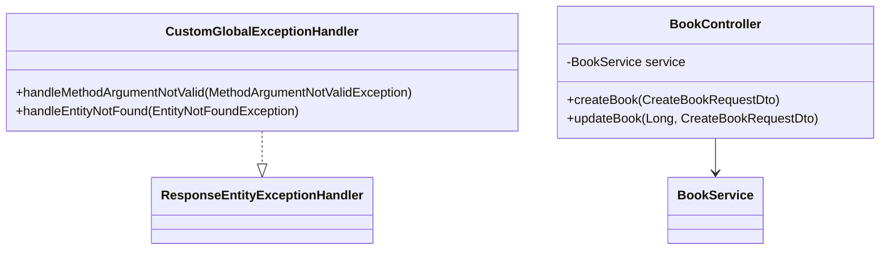

# UML

```mermaid
classDiagram
    class CustomGlobalExceptionHandler {
        +handleMethodArgumentNotValid(MethodArgumentNotValidException)
        +handleEntityNotFound(EntityNotFoundException)
    }
    class BookController {
        -BookService service
        +createBook(CreateBookRequestDto)
        +updateBook(Long, CreateBookRequestDto)
    }
    
    BookController --> BookService
    CustomGlobalExceptionHandler ..|> ResponseEntityExceptionHandler
```
